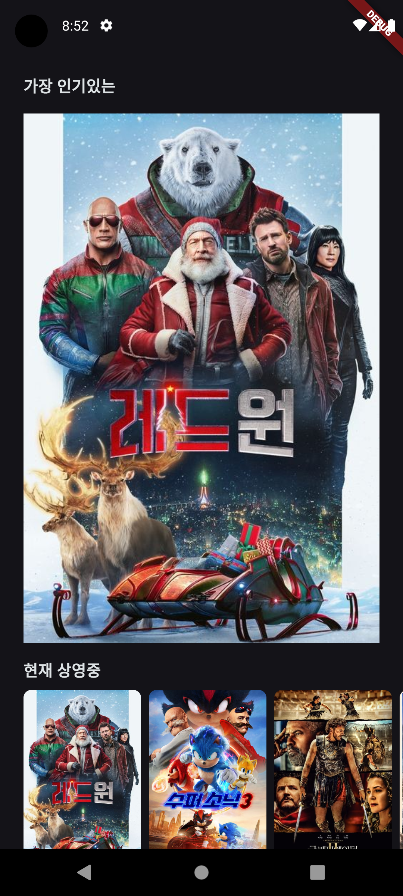

# Movie Info App
개인 과제 - 영화 정보 앱

## 프로젝트 소개
아래의 기능들이 있는 영화 정보 앱

## 실행 영상
[[프로젝트 실행 영상]](https://github.com/Hamiric/Movie_Info_App_PersonalProject)

 

| HomePage | DetailPage |
| --- | --- |
|  |  |

 

< 필수 기능 > 
1. 화면 구현 (HomePage, DetailPage)
2. Hero 위젯을 사용한 애니메이션 효과
3. 클린 아키텍쳐를 활용해 TMDB API 가져오기

< 도전 기능 >
1. 테스트 코드 작성하기
2. 나만의 기능 추가
    
## 적용 기능
#### < 필수 기능 >
>* 화면 구현 (HomePage, DetailPage) : 
 영화 정보앱 UI 화면 구현  
>* Hero 위젯을 사용한 애니메이션 효과 : 
 페이지 전환시 같은 태그의 위젯끼리 연결되는듯한 Hero 애니메이션 효과 적용  
>* 클린 아키텍쳐를 활용해 TMDB API 가져오기 : 
 TMDB API 를 사용해, 현재 상영중, 인기순, 평점 높은순, 개봉예정, 영화 상세 관련 데이터를 가져오기. 구현시 클린 아키텍처를 활용해, 데이터레이어, 도메인레이어, 프레젠레이어를 나눠 코드 작성하기  
#### < 도전 기능 >
>* 테스트 코드 작성하기 :
 각각의 로직이 정상적으로 작동하는지 확인할 수 있는 테스트 코드를 작성하기  
#### < 자유 구현 >
>* 

## 🚨 Trouble Shooting

📚[ Go_router의 트렌지션 효과, Hero 위젯 1대다 매칭법 ]

### [ TIL - Go_router의 트렌지션 효과, Hero 위젯 1대다 매칭법 ](https://hamiric.tistory.com/99)

  

## 📝Technologies & Tools (FE)

| 기술스택 | 배지 |
| --- | --- |
| Language |  |
| Framework |  |
| Code Editor |  |
| Library |     |
| Version Control |   |