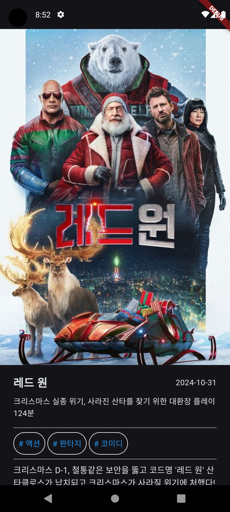
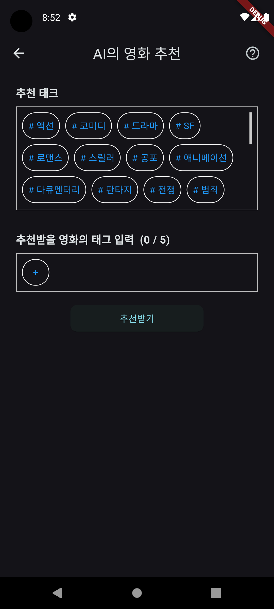
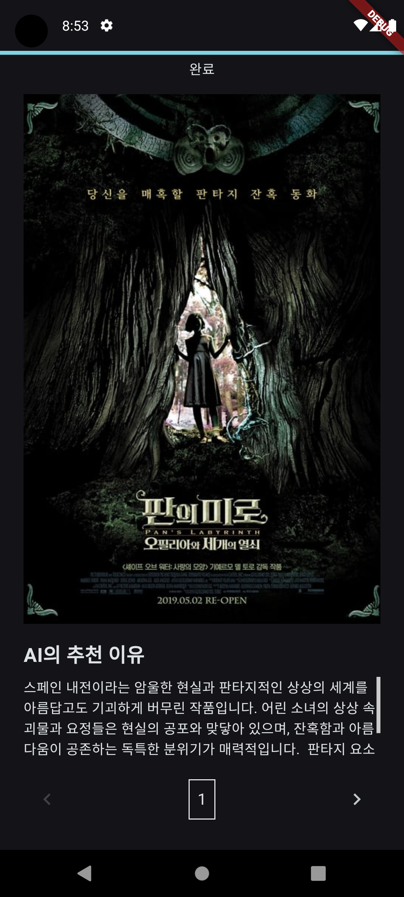

# Movie Info App
개인 과제 - 영화 정보 앱

## 프로젝트 소개
아래의 기능들이 있는 영화 정보 앱

## 실행 영상
[[프로젝트 실행 영상]](https://youtu.be/OFab2P-uKIw)

 

| HomePage | DetailPage | RecommendPage | AiPage |
| --- | --- | --- | --- |
|  |  |  |  |

 

< 필수 기능 > 
1. 화면 구현 (HomePage, DetailPage)
2. Hero 위젯을 사용한 애니메이션 효과
3. 클린 아키텍쳐를 활용해 TMDB API 가져오기

< 도전 기능 >
1. 테스트 코드 작성하기
2. 나만의 기능 추가
    
## 적용 기능
#### < 필수 기능 >
>* 화면 구현 (HomePage, DetailPage) : 
 영화 정보앱 UI 화면 구현  
>* Hero 위젯을 사용한 애니메이션 효과 : 
 페이지 전환시 같은 태그의 위젯끼리 연결되는듯한 Hero 애니메이션 효과 적용  
>* 클린 아키텍쳐를 활용해 TMDB API 가져오기 : 
 TMDB API 를 사용해, 현재 상영중, 인기순, 평점 높은순, 개봉예정, 영화 상세 관련 데이터를 가져오기. 구현시 클린 아키텍처를 활용해, 데이터레이어, 도메인레이어, 프레젠레이어를 나눠 코드 작성하기  
#### < 도전 기능 >
>* 테스트 코드 작성하기 :
 각각의 로직이 정상적으로 작동하는지 확인할 수 있는 테스트 코드를 작성하기  
#### < 자유 구현 >
>* 입력된 태그를 기반으로, AI가 영화를 추천해주는 기능 : 
 태그를 입력하여, AI에게 태그에 맞는 영화를 5개정도 추천해주도록 한다. 태그 입력은, 추천 태그중 하나를 눌러서 넣어도 되고, + 버튼을 눌러 직접 작성해도 된다. 다만, 너무 터무니 없는 태그를 넣었을 경우 AI가 엉뚱한 답변을 할 수도 있으니 주의!  
>* AI가 추천해주는 영화를 검색하는 기능 :  AI가 영화를 추천해 주면, 자동으로 해당 영화의 제목을 TMDB에 검색하여, 해당 영화의 정보를 받아온다.  

## 🚨 Trouble Shooting

📚[ Go_router의 트렌지션 효과, Hero 위젯 1대다 매칭법 ]

### [ TIL - Go_router의 트렌지션 효과, Hero 위젯 1대다 매칭법 ](https://hamiric.tistory.com/99)

  

## 📝Technologies & Tools (FE)

| 기술스택 | 배지 |
| --- | --- |
| Language |  |
| Framework |  |
| Code Editor |  |
| Library |       |
| Version Control |   |